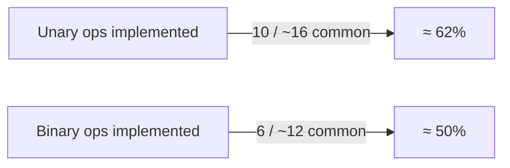

# CUDA Kernel Coverage

This document enumerates **element-wise unary / binary operators** currently backed by efficient CUDA kernels in `acediaR`, and highlights gaps that warrant new kernel work.

## 1. Supported Scalar Data Types

| Type | R dtype string | CUDA representation | Kernel support level |
|------|----------------|---------------------|---------------------|
| `half` | `float16` | `__half` (CUDA fp16) | Contiguous element-wise & matmul; stride-aware ops incomplete |
| `float` | `float32` | `float` | Full support across all kernels |
| `double` | `float64` | `double` | Full support across all kernels |
| `int8_t` | `int8` | `int8_t` | Add only (contiguous) |
| `int32_t` | `int32` | `int32_t` | Add only (contiguous) |
| `int64_t` | `int64` | `int64_t` | Add only (contiguous) |
| `__nv_bfloat16` | `bfloat16` | `__nv_bfloat16` (sm_80+) | Conversion utilities only – no math kernels |

> _Note_: Additional integer and boolean dtypes can be added by instantiating existing templates.

---

## 2. Unary Operators

| Operator | Kernel Functor | Files | Types implemented | Notes |
|----------|---------------|-------|-------------------|-------|
| `exp` | `ExpOp` | `tensor_ops.cu` | fp16/32/64 | Stride-aware variant present |
| `log` | `LogOp` | `tensor_ops.cu` | fp16/32/64 | " |
| `sqrt` | `SqrtOp` | `tensor_ops.cu` | fp16/32/64 | " |
| `tanh` | `TanhOp` | `tensor_ops.cu` | fp16/32/64 | Contiguous only |
| `sigmoid` | `SigmoidOp` | `tensor_ops.cu` | fp16/32/64 | Contiguous only |
| `relu` | `ReluOp` | `tensor_ops.cu` | fp16/32/64 | Contiguous only; Leaky variant not exposed |
| `sin` | `SinOp` | `tensor_ops.cu` | fp16/32/64 | Contiguous only |
| `cos` | `CosOp` | `tensor_ops.cu` | fp16/32/64 | Contiguous only |
| `abs` | `AbsOp` | `tensor_ops.cu` | fp16/32/64 | Contiguous only |
| `square` | `SquareOp` (helper) | `tensor_ops.cu` | fp16/32/64 | Intermediary for variance computation |

_Missing frequently-used unary ops_: `pow(x, c)`, `floor`, `ceil`, `round`, `erf`, `negation` (−x), `logical_not`.

---

## 3. Binary Operators

### 3.1 Contiguous Element-wise

| Operator | Kernel Functor | Files | Types implemented | Notes |
|----------|---------------|-------|-------------------|-------|
| `add` ( + ) | `AddOp` | `tensor_ops.cu` | fp16/32/64, int8/32/64 | Full coverage |
| `sub` ( − ) | `SubOp` | `tensor_ops.cu` | fp16/32/64 | int & fp16 strided variants TODO |
| `mul` ( * ) | `MulOp` | `tensor_ops.cu` | fp16/32/64 | " |
| `div` ( / ) | `DivOp` | `tensor_ops.cu` | fp16/32/64 | " |
| `greater` | `GreaterOp` | `tensor_ops.cu` | fp32/64 | Returns bool as 0/1 float |
| `less` | `LessOp` | `tensor_ops.cu` | fp32/64 | " |
| `equal` | `EqualOp` | `tensor_ops.cu` | fp32/64 | " |

_Missing binary ops_: `max(a, b)`, `min(a, b)`, `pow(a, b)`, bitwise & logical operators.

### 3.2 Broadcast-aware Kernels

| Operator | Types | File | Status |
|----------|-------|------|--------|
| `add` | float32/64 | `tensor_wrappers.cu.disabled` & `tensor_ops.cu` | **Working** (wrappers exist) |
| `mul` | float32/64 | same | **Working** |
| `sub`, `div` | – | – | **Missing** |

### 3.3 Scalar Variants

Scalar add / mul for fp16/32/64 implemented via `elementwise_scalar_kernel`.
_No scalar sub/div yet._

---

## 4. Reduction Operations

A generic `reduction_kernel` exists supporting any associative op (`MaxOp`, `MinOp`, `AddOp`, etc.). Host helpers exposed inside `tensor_ops.cu`, but **no R-level APIs** currently forward these kernels. Adding thin `extern "C"` wrappers will unlock `sum`, `mean`, `max`, `min`, etc.

---

## 5. Coverage Heat-map

---

### Action Items
1. Finish missing unary (`pow`, `floor`, etc.) and binary (`max`, `min`, logical`) functors; instantiate templates.
2. Extend broadcast helpers to **sub/div** and additional dtypes.
3. Add Rcpp bindings & tests for reduction ops.
4. Implement stride-aware kernels for fp16 & integer types, or document limitation.

---
Generated automatically from `src/kernels/` contents. 