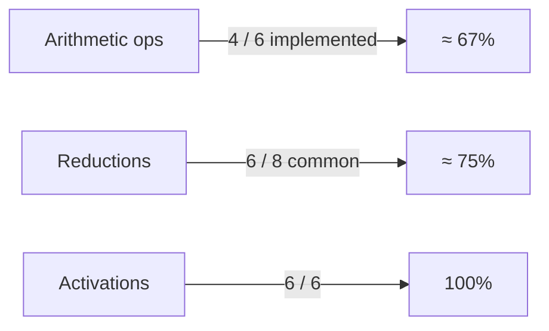

# R API Coverage for Tensor Operations

This document cross-references **high-level R functions / S3 methods** against the underlying C++ unified API, noting where wrappers or features are still missing.

_Last updated: 2025-07-25_

## 1. Tensor Construction & Conversion

| R Function | Backing C++ Call | GPU-resident? | Notes |
|------------|------------------|--------------|-------|
| `gpu_tensor()` | `create_tensor_unified` | Yes | Main entry point; validates dtype/device |
| `empty_tensor()` | `create_empty_tensor_unified` | Yes | Works |
| `as_tensor()` | `create_tensor_unified` | Yes | Generic coercion |
| `as.array.gpuTensor` / `as.vector` | `tensor_to_r_unified` | Data → CPU | OK |
| `dtype()` | `tensor_dtype_unified` | No side-effect | Implemented as S3 generic |

## 2. Arithmetic Operators (gpuTensor)

| Operator | R Method | C++ Call | Broadcast? | Status |
|----------|----------|----------|-----------|--------|
| `+` | `+.gpuTensor` | `tensor_add_unified` | Yes | Working |
| `-` binary | Missing | `tensor_sub_unified` | Yes | **TODO** |
| `*` | `*.gpuTensor` | `tensor_mul_unified` | Yes | Working |
| `/` binary | Missing | `tensor_div_unified` | Yes | **TODO** |
| Unary `-` | Missing | (would call scalar mul −1) | n/a | **TODO** |

Scalar counterparts use `tensor_scalar_add_unified` / `tensor_scalar_mul_unified`; `scalar_sub/div` absent.

## 3. Math / Activation Functions

| R Helper | C++ Call | GPU? | Notes |
|----------|----------|------|-------|
| `exp(x)` (via S3) | `tensor_exp_unified` | Yes | Implemented in `gpuTensor.R` using S3 dispatch |
| `log`, `sqrt`, `abs` | respective unified calls | Yes | OK |
| `tanh`, `sigmoid`, `relu`, `sin`, `cos` | activation wrappers | Yes | Work |
| **Missing** | `ceil`, `floor`, `round`, `pow` | – | Need wrappers once C++ kernels exist |

## 4. Linear Algebra

| Function | C++ Call | GPU? | Notes |
|----------|----------|------|-------|
| `matmul` | `tensor_matmul_unified` | Yes | No batched version |
| `outer_product` | `tensor_outer_product_unified` | Yes | OK |
| `matvec`, `vecmat` | respective unified | Yes | OK |

## 5. Reductions

| R S3 Method | C++ Call | Axis support | Notes |
|-------------|----------|-------------|-------|
| `sum.gpuTensor` | `tensor_sum_unified` | Global only | Works, no dim arg |
| `mean.gpuTensor` | `tensor_mean_unified` | Global only | Works |
| `max`, `min`, `prod`, `var` | respective unified | Global only | OK |
| **Missing** | `sd`, `argmax/argmin` wrappers | – | Argmax C++ exists (`tensor_argmax_unified`) but no R helper |

## 6. View / Transform

| R Function | C++ Call | Notes |
|------------|----------|-------|
| `view` (alias of `tensor_view_unified`) | `tensor_view_unified` | Maintains same data, different shape |
| `reshape` | `tensor_reshape_unified` | Potentially allocates copy if non-contiguous |
| `transpose`, `permute` | respective unified | OK |
| `repeat`, `pad`, `concat`, `stack` | unified calls | Present; high-level docstrings TODO |

## 7. Boolean / Comparison

| Function | C++ Call | Output dtype | Status |
|----------|----------|-------------|--------|
| `>` (implemented via `tensor_gt_unified`) | Yes | float32 mask | R operator overloaded? **Missing** |
| `<` , `==` | `tensor_lt_unified`, `tensor_eq_unified` | float32 mask | Need S3 overloading |

## 8. Stand-alone Vector Helpers

| Helper | GPU path | CPU fallback | Status |
|--------|----------|-------------|--------|
| `gpu_add`, `gpu_multiply` | `gpu_tensor` + operator | Yes | OK |
| `gpu_scale` | scalar × tensor | Yes | OK |
| `gpu_dot` | element-wise × + reduction | Yes | Uses `tensor_sum`; performance decent |

## 9. Diagnostics & Environment

| Helper | C++ Call | Notes |
|--------|----------|-------|
| `gpu_available` | `gpu_available` | auto-generated |
| `gpu_info`, `gpu_memory_available` | respective | OK |
| `gpu_status` | Composite | Fine |

---

### Coverage Heat-map

---

### Action Items
1. Add S3 methods for missing operators (`-.gpuTensor`, `/.gpuTensor`, unary `-`, comparisons).
2. Implement axis support (`dim`, `keepdims`) in reductions.
3. Export argmax / argmin helpers wrapping existing C++.
4. Surface advanced transforms (`pad`, `repeat`, `concat`, `stack`) in user documentation.

---
Generated from automated analysis of `R/` sources and `RcppExports.R`. 